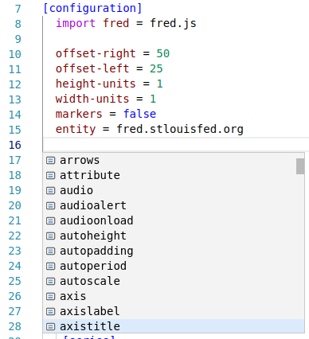

# Axibase Charts Extension for VSCode

[](https://marketplace.visualstudio.com/items?itemName=Axibase.axibasecharts-syntax)

**Axibase Charts** extension for Microsoft [Visual Studio Code](https://code.visualstudio.com/) is a design tool that simplifies portal development and data exploration using the [Axibase Charts](https://github.com/axibase/charts/blob/master/README.md) library of declarative graphics.

The extension implements the following functionality:

* Code highlighting
* Syntax validation
* Auto-completion
* Settings reference
* Live preview

## Installation

* Open VSCode and click the **Extensions** tab in the left menu.
* Search for `axibase` in the VSCode Extensions Marketplace.
* Install the extension and reload VSCode.


## Requirements

* VSCode `1.27.2+`

## Support

Include VSCode and extension version when opening issues on Github.

* VSCode version is displayed in the main menu, on the **About Visual Studio Code** dialog window.

  

* Locate extension version on the **Extensions** tab located in the main menu.

  

## Introduction

Build portals with [Axibase Charts](https://github.com/axibase/charts/blob/master/README.md).

To display available completions, press `Ctrl+Space` on PC or `⌃Space` on Mac.

  

## Live Preview

The extension shows a preview of the portal in the VSCode interface by requesting data from the target server.

To configure the target server, open **Preferences > Settings** and enter `axibase` in the search box.

Specify connection properties.


Click **Show Preview** in the upper-right corner to view the current portal.


> The portal is rendered based on the configuration displayed in the Editor pane, even if the text is not saved.

Enter user password, if connecting for the first time.


### SSL Certificates

VSCode does not allow secure connections to servers with untrusted (self-signed) SSL certificates.

To resolve certificate validation errors:

* Add the self-signed SSL certificate from the target server to root CAs on the operating system where VSCode is installed. Restart VSCode.
* Start VSCode with `code --ignore-certificate-errors` command to [skip certificate validation](https://code.visualstudio.com/docs/setup/network#_ssl-certificates).

  > To launch VScode with `code --ignore-certificate-errors`, add code to `PATH` by typing `⇧⌘P`, then `ShelC` on Mac.

  

## Syntax Highlighting

Syntax highlighting uses colors defined in VSCode themes. To choose a different theme, for example `Light+(default light)`, open **File > Preferences > Color Theme**.


## Code Formatting


## Snippets

* `{widget_name}`: Creates a new `[widget]` section with a pre-configured sample widget.
* `configuration`: Creates a new `[configuration]` section with child `[group]` section and initial settings.
* `for`: Creates a new `for` loop with corresponding `endfor`.
* `if`: Creates a new `if` statement with corresponding `endif`.
* `series {type}`: Possible `{type}` values are `with tags`, `detail`, `averaged`. Creates a new `[series]` section.
* `portal: 3x2`: Creates a new portal with `6` widgets organized into `3` columns and `2` rows.

## Validation

* Unknown `alias`.

  ```ls
  [series]
    alias = s1

  [series]
    value = value('a1')
  ```

* Incomplete `for`, `csv`, `var`, `list`, `script`, `if` block.

  ```ls
  list values = value1, value2,
    value3, value4
  # no matching endlist
  ```

* Malformed `csv` definition.

  ```ls
  csv servers =
    name, price
    vps, 5
    vds, 5, 4 /* wrong number of columns */
  endcsv
  ```

* Unmatched tags `endcsv`, `endif`, `endfor`, `endvar`, `endscript`, `endlist`.

  ```ls
  var array = [
    "value1", "value2"
  ]
  endlist
  # endlist can not finish var statement
  ```

* Undefined variable in `for` loop.

  ```ls
  for server in servers
    [series]
      entity = @{srv} /* for variable is server, but srv is used */
  endfor
  ```

* Undefined collection in `for` loop.

  ```ls
  list servers = vps, vds
  for server in serverc /* misspelling */
    [series]
      entity = @{server}
  endfor
  ```

* `else` or `elseif` statement without corresponding `if`.

  ```ls
  for item in collection
    [series]
    # no 'if' keyword
    elseif item == 'vps'
      metric = vps
    else
      metric = vds
    endif
  endfor
  ```

* Duplicate variable definition.

  ```ls
  list collection = value1, value2
  var collection = [ "value1", "value2" ]
  # duplicate variable name
  ```

  ```ls
  for server in servers
    for server in servers
      # duplicate variable name
    endfor
  endfor
  ```

* Duplicate settings.

  ```ls
  [series]
    entity = server
    entity = srv /* duplicate setting */
    metric = cpu_busy
  ```

* Required setting missing.

  ```ls
  [widget]
    # type is required
    [series]
    ...
  ```

  ```ls
  [series]
    entity = server
    # metric is required
  [widget]
  ```

* Misspelled setting.

  ```ls
  [wigdet]
    # "wigdet" instead of "widget"
    type = chart
  ```

  ```ls
  [series]
    startime = now
    # "startime" instead of "starttime"
  ```

* `for` finishes before `if`.

  ```ls
  for server in servers
    [series]
      if server == 'vps'
        entity = 'vds'
      else
        entity = 'vps'
  endfor
  # if must be finished inside the for
  endif
  ```

* Setting is interpreted as a tag.

  ```ls
  [tags]
    server_name = 'vds'
  time-span = 1 hour
  # time-span will be interpreted as a tag
  ```

* JavaScript errors if `axibaseCharts.validateFunctions` is `true`:

  ```ls
  script
    widget = hello() // widget is allowed variable, since it comes from Charts
    // hello() is unknown function, the plugin warns about it
  endscript
  ```

  ```ls
  [series]
    value = 5 + ; // forgotten operand
  ```

## User Defined Completions

### Snippets

* To display the list of pre-configured snippets, press `Ctrl+Shift+P` on PC or `⇧⌘P` on Mac and enter `Insert Snippet`.

  

* To add a new snippet, refer to [VSCode Documentation](https://code.visualstudio.com/docs/editor/userdefinedsnippets).

* To add new snippets to the extension use `snippets/snippets.json` file using pre-configured snippets as examples.